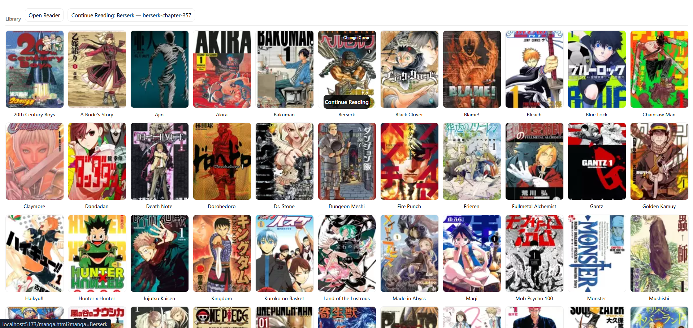
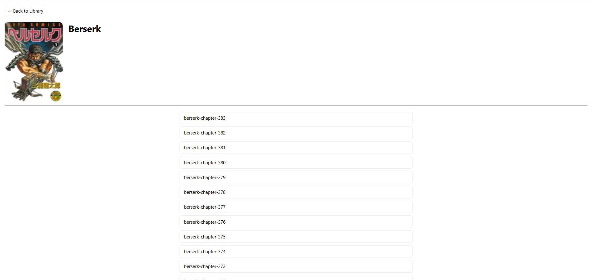
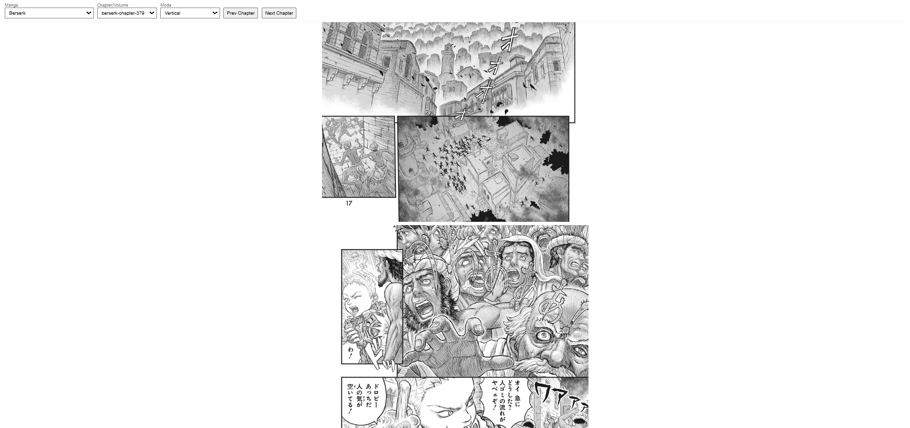
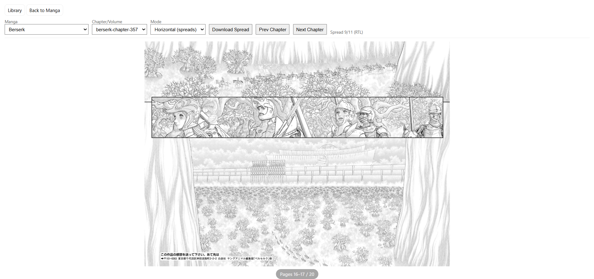

# Local Manga Reader

A minimal local manga reader with:

- Vertical scroll mode  
- Horizontal (RTL spread) mode  
- Responsive library grid  
- Drag & drop cover uploads  
- Multiple cover format support  
- Local progress memory (per manga)

---

## Features

### Reader
- Vertical scrolling mode
- Horizontal RTL spread mode
- Keyboard navigation (Arrow keys)
- Per-manga last chapter memory
- Mode persistence (vertical / horizontal)
- Download current spread in horizontal mode
- Chapter switching with toast notification

### Library
- Responsive cover grid (number of columns adapts to available width — screen size and browser zoom both affect layout)
- Click cover to open manga
- Continue reading button
- Drag & drop image onto a cover to change it
- Hover → **Change Cover** button
- Instant refresh after upload (no reload required)

### Manga page
- Dedicated manga page with cover and chapter list
- Continue reading button for the last opened chapter
- Chapter list shown newest first

---

## Screenshots

### Library


### Manga page


### Reader - Vertical mode


### Reader - Horizontal mode


---

## File Structure

```text
manga-reader/
├─ server.js
├─ package.json
├─ package-lock.json
├─ placeholder.jpg                 # used in horizontal (spread) view
├─ README.md
├─ data/
│  └─ state.json                   # saved reading state and preferences
├─ library/                        # local manga library
│  ├─ Berserk/
│  │  ├─ cover.jpg                 # optional
│  │  └─ 001/
│  │     ├─ page_1.webp
│  │     ├─ page_2.webp
│  │     └─ ...
│  └─ One Piece/
│     ├─ cover.png
│     ├─ ch_001/
│     │  ├─ image1.jpg
│     │  └─ ...
│     └─ ch_002/
│        ├─ 001.png
│        └─ ...
└─ public/
   ├─ index.html                   # reader
   ├─ library.html                 # library grid
   ├─ manga.html                   # manga details page
   ├─ app.js
   ├─ library.js
   ├─ manga.js
   ├─ style.css
   └─ cover-placeholder.png        # fallback cover
```

---

## Covers

Each manga folder can contain an optional cover file:

```text
cover.png
cover.jpg
cover.jpeg
cover.webp
cover.gif
```

Covers can be changed by:

- Dragging and dropping an image onto a cover
- Clicking **Change Cover**

The image is saved automatically as:

```text
library/<Manga>/cover.<ext>
```

If no cover exists, `public/cover-placeholder.png` is used.

---

## How to Run

Install dependencies (once):

```bash
npm install
```

Start the server:

```bash
node server.js
```

Open:

```text
http://localhost:5173
```

---

## Routes

- `/` → Library
- `/index.html` → Reader
- `/library.html` → Library grid
- `/manga.html?manga=Name` → Manga page
- `/cover?manga=Name` → Serve cover image
- `/api/*` → Backend API endpoints